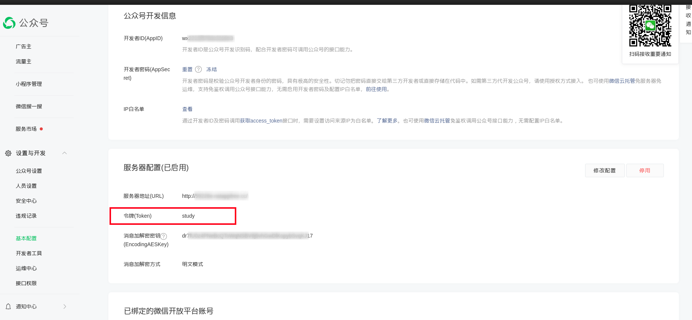

# 打卡统计程序

项目功能: 开发微信公众平台，使用微信公众号进行打卡。<br><br>

技术栈: <br>

```
后端: Actix Web
ORM: RBatis
数据库： SQLite 3
```

## 1. 使用方法

用户要按照规则进行打卡，将打卡图片上传到管理员指定的微信公众号, 后台会自动统计打卡情况。
在微信公众号中输入下列命令，可以进行相应的操作:

```
r username: 注册用户，用户名为username(将username改为自己想要用的用户名)
h         : 查看帮助

以下操作需要管理员权限
d user_id: 将id为user_id的用户删除
a user_id: 将id为user_id的用户激活
l        : 显示所有用户
c frequency: 修改打卡规则，在前frequency天内打过卡就算完成了任务，例如freq为2表示如果前天和昨天打过卡，就算完成了打卡任务
```

在公众号中上传图片，即可打卡，图片上传成功会有相应的提示。

## 2. 后台配置

后台程序每天0点会进行打卡情况统计，并将统计结果上传到远程git仓库, 远程git仓库的名称和URL在src/global/git.rs中,
编译项目前应先建好自己的远程git仓库，并将服务器的SSH key在远程git仓库的托管平台配置好，保证服务器能将打卡统计结果push到远程仓库中。

```rust
// src/global/git.rs
pub(crate) const GIT_REMOTE_REPOSITORY_URL: &str = "git@gitee.com:jcglqmoyx/task.git";
pub(crate) const GIT_REPOSITORY_NAME: &str = "task";
```

使用`cargo build --release`命令编译项目, 编译成功后target/release/study这个可执行文件即为后台程序, 将该程序和数据库文件`study.db`一起部署在服务器上，放到同一个文件夹下, 启动服务。

配置好微信公众平台的开发者选项(详情见微信公众平台开发者文档), "服务器配置->令牌(Token)" 这里要和项目代码文件src/global/token.rs中的配置相同:
```rust
pub(crate) const WECHAT_OFFICIAL_ACCOUNT_VERIFICATION_TOKEN: &'static str = "study";
```



每天将远程仓库中的index.md文件(该文件中包含打卡情况统计结果)的链接发到群里，提醒没有打卡的人。

## License
This project is licensed under Apache License 2.0 - see the [LICENSE](LICENSE) file for details.
